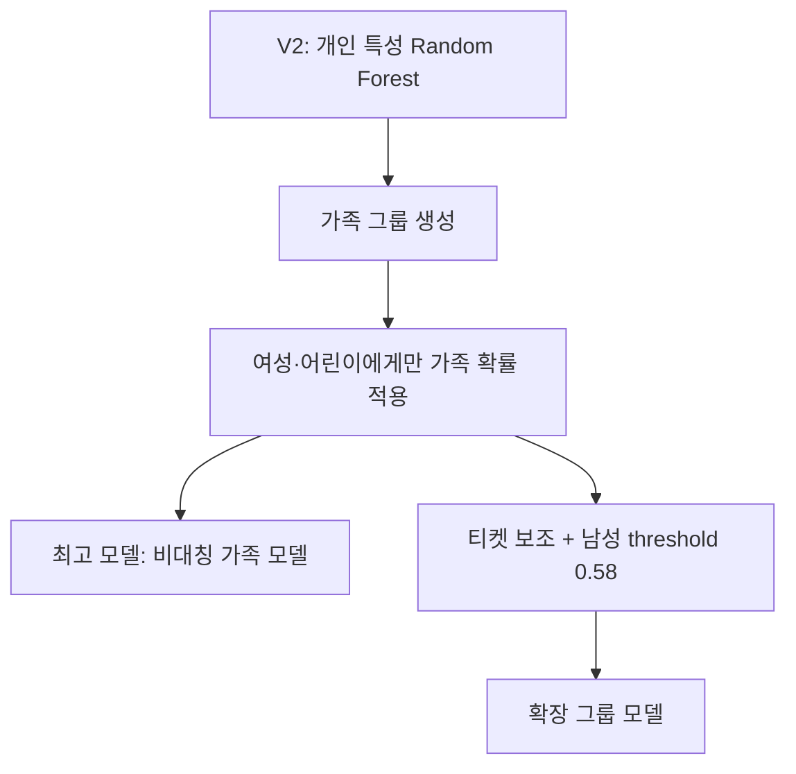

# 7월 13일 Titanic 생존 예측 모델 개선 보고서

## 1. 연구 개요

본 프로젝트의 목적은 Kaggle Titanic 데이터에서 승객의 생존 여부를 예측하고, 단순한 머신러닝 기준 모델에서 출발해 가족·티켓과 같은 승객 집단 정보를 반영했을 때 성능이 어떻게 달라지는지 분석하는 것이다.

분석 과정에서는 다음 세 모델을 핵심 비교 대상으로 선정했다.

1. **V2 Random Forest 기준 모델**: 개인 단위의 기본 변수만 사용
2. **확장 그룹 모델**: 가족·티켓 정보와 성인 남성 전용 threshold를 추가
3. **비대칭 가족 모델**: 여성·어린이에게만 가족 생존 정보를 적용한 최종 최고 모델

최종 평가 데이터의 정답은 모델 설계와 교차검증 과정에서는 사용하지 않고, 후보 모델을 확정한 뒤 성능을 확인하는 블랙박스 평가 용도로만 사용했다.

---

## 2. 데이터 구성

### 2.1 데이터 크기

| 데이터 | 승객 수 | 목적변수 포함 여부 |
|---|---:|---|
| `train.csv` | 891명 | `Survived` 포함 |
| `test.csv` | 418명 | `Survived` 미포함 |

### 2.2 주요 변수

| 변수 | 의미 | 모델에서의 역할 |
|---|---|---|
| `Pclass` | 객실 등급 | 사회·경제적 위치와 대피 접근성의 간접 지표 |
| `Sex` | 성별 | 생존을 구분하는 가장 강한 변수 중 하나 |
| `Age` | 나이 | 어린이 우선 대피 여부를 반영 |
| `SibSp` | 동승한 형제자매·배우자 수 | 가족 규모 계산에 사용 |
| `Parch` | 동승한 부모·자녀 수 | 가족 규모 계산에 사용 |
| `Ticket` | 티켓 번호 | 가족 또는 여행 일행 탐색에 사용 |
| `Fare` | 승선 요금 | 객실 등급 및 경제적 위치의 간접 지표 |
| `Cabin` | 객실 번호 | 결측값이 많아 기준 모델에서는 제외 |
| `Embarked` | 승선 항구 | 승객 집단 구성의 간접 지표 |

### 2.3 결측값 처리

- `Age`, `Fare` 등 수치형 변수: 학습 데이터의 중앙값으로 대체
- `Sex`, `Embarked`, `Pclass` 등 범주형 변수: 최빈값으로 대체 후 원-핫 인코딩
- 수치형 변수에는 결측 여부 표시 열을 추가해, 값이 없었다는 사실 자체도 모델이 활용할 수 있도록 구성

결측값을 0으로 채우거나 결측 행을 삭제하지 않은 이유는 0세와 결측값의 의미가 다르고, 891명뿐인 학습 표본을 삭제하면 정보 손실이 커지기 때문이다.

---

## 3. 모델 개선 흐름



핵심 발전은 모든 승객에게 같은 가족 규칙을 적용하지 않고, **여성과 어린이에게만 가족 생존 정보를 반영하는 비대칭 구조**를 도입한 것이다.

---

## 4. 모델 1: V2 Random Forest 기준 모델

### 4.1 입력 변수

```text
Pclass, Sex, Age, SibSp, Parch, Fare, Embarked
```

### 4.2 모델 설정

| 항목 | 값 |
|---|---:|
| 알고리즘 | Random Forest |
| 트리 수 | 500 |
| 최대 깊이 | 6 |
| 최소 분할 표본 | 5 |
| 최소 리프 표본 | 2 |
| 최대 특성 선택 | sqrt |
| 분류 threshold | 0.50 |

Random Forest는 여러 결정 트리의 결과를 평균내므로 단일 결정 트리보다 분산이 작고 과적합에 비교적 강하다. 그러나 이 모델은 각 승객을 독립된 표본으로 보고, 동일 가족이나 여행 일행의 결과를 직접 활용하지 못한다.

### 4.3 기준 모델 결과

- 테스트 정확도: **0.78469**
- 정답: 328명
- 오답: 90명
- 사망 예측: 282명
- 생존 예측: 136명

---

## 5. 모델 2: 가족·티켓·남성 threshold 확장 모델

### 5.1 추가 규칙

확장 모델은 다음 순서로 그룹 정보를 적용했다.

1. 성씨와 가족 규모가 같은 승객을 가족으로 정의
2. 여성 또는 16세 미만 어린이에게 가족 생존 확률 적용
3. 가족 정보가 없으면 같은 티켓의 여성·어린이 생존 정보를 보조적으로 사용
4. 성인 남성의 생존 threshold를 `0.50`에서 `0.58`로 상향

가족 식별자는 다음과 같이 구성했다.

```text
FamilyKey = Surname + "_" + (SibSp + Parch + 1)
``` 

혼자 탑승한 승객은 가족 그룹에서 제외했다. 같은 성씨라는 이유만으로 서로 무관한 1인 승객을 가족으로 묶는 오류를 방지하기 위해서다.

### 5.2 성인 남성 threshold 조정

일반적인 분류에서는 생존 확률이 0.50 이상이면 생존으로 판정한다.

```text
일반 승객: 생존 확률 >= 0.50
성인 남성: 생존 확률 >= 0.58
```

이는 동일 가족의 여성·어린이가 생존하더라도 성인 남성의 생존 가능성은 상대적으로 낮다는 train 데이터의 구조를 반영한 것이다.

### 5.3 확장 모델 결과

- 테스트 정확도: **0.80144**
- 정답: 335명
- 오답: 83명
- 사망 예측: 285명
- 생존 예측: 133명
- V2와 다른 예측: 11명

확장 규칙은 V2보다 7명을 더 맞혔지만, 최종 최고 모델보다는 1명을 더 틀렸다. 규칙을 더 많이 추가한다고 항상 실제 성능이 높아지는 것은 아니라는 점을 보여준다.

---

## 6. 모델 3: 비대칭 가족 모델

### 6.1 핵심 가설

가족 구성원의 생존 결과는 서로 연관되어 있지만 그 효과가 성별과 나이에 따라 동일하지 않다.

- 여성·어린이: 가족 단위로 함께 구조되거나 함께 사망하는 경향이 비교적 강함
- 성인 남성: 가족이 생존하더라도 본인은 사망하는 사례가 많음

따라서 가족 확률은 다음 조건에만 적용했다.

```python
Sex == "female" or Age < 16
```

성인 남성은 가족 결과와 무관하게 Random Forest의 기본 확률을 유지했다.

### 6.2 가족 생존율 평활화

가족 구성원이 1명뿐인 경우 생존율이 곧바로 0 또는 1이 되는 문제를 줄이기 위해 전체 생존율을 가상 표본 2명만큼 추가했다.

$$
P_{family}
=
\frac{\text{가족 생존자 수}+2P_{global}}
{\text{확인된 가족 수}+2}
$$

최종 확률은 Random Forest와 가족 확률을 같은 비율로 결합했다.

$$
P_{final}
=
0.5P_{RF}+0.5P_{family}
$$

### 6.3 최종 모델 결과

- 테스트 정확도: **0.80383**
- 정답: 336명
- 오답: 82명
- 사망 예측: 284명
- 생존 예측: 134명
- V2와 다른 예측: 12명
- 확장 그룹 모델과 다른 예측: 단 1명

최종 모델은 V2보다 8명을 더 맞혔으며 정확도를 약 1.91%p 높였다.

---

## 7. 성능 비교

### 7.1 전체 평가 지표

| 모델 | 정확도 | Precision(생존) | Recall(생존) | F1(생존) | 정답 수 | 오답 수 |
|---|---:|---:|---:|---:|---:|---:|
| V2 Random Forest | 0.78469 | 0.75000 | 0.64557 | 0.69388 | 328 | 90 |
| 확장 그룹 모델 | 0.80144 | 0.78195 | 0.65823 | 0.71478 | 335 | 83 |
| **비대칭 가족 모델** | **0.80383** | **0.78358** | **0.66456** | **0.71918** | **336** | **82** |

### 7.2 정확도 변화

```text
V2                  78.47%  ███████████████████████████████████████
확장 그룹 모델       80.14%  ████████████████████████████████████████
비대칭 가족 모델     80.38%  ████████████████████████████████████████
```

| 비교 | 정확도 변화 | 추가 정답 수 |
|---|---:|---:|
| V2 → 확장 그룹 모델 | +1.67%p | +7명 |
| V2 → 비대칭 가족 모델 | **+1.91%p** | **+8명** |
| 확장 그룹 → 비대칭 가족 | +0.24%p | +1명 |

### 7.3 예측 분포

| 모델 | 사망 예측 | 생존 예측 | 생존 예측 비율 |
|---|---:|---:|---:|
| V2 | 282 | 136 | 32.54% |
| 확장 그룹 모델 | 285 | 133 | 31.82% |
| 비대칭 가족 모델 | 284 | 134 | 32.06% |
| 실제 정답 | 260 | 158 | 37.80% |

세 모델 모두 실제보다 생존자를 적게 예측했다. 최종 모델은 단순히 생존 예측 수를 늘려 정확도를 높인 것이 아니라, 일부 승객의 사망·생존 판단 위치를 더 정확하게 교환한 결과 성능이 개선됐다.

---

## 8. 혼동행렬 비교

혼동행렬의 행은 실제값, 열은 예측값이다.

### 8.1 V2 Random Forest

| 실제 \ 예측 | 사망(0) | 생존(1) |
|---|---:|---:|
| 사망(0) | 226 | 34 |
| 생존(1) | 56 | 102 |

### 8.2 확장 그룹 모델

| 실제 \ 예측 | 사망(0) | 생존(1) |
|---|---:|---:|
| 사망(0) | 231 | 29 |
| 생존(1) | 54 | 104 |

### 8.3 비대칭 가족 모델

| 실제 \ 예측 | 사망(0) | 생존(1) |
|---|---:|---:|
| 사망(0) | 231 | 29 |
| 생존(1) | 53 | 105 |

비대칭 가족 모델은 V2와 비교해 다음과 같이 개선됐다.

- 실제 사망자를 생존으로 잘못 예측한 수: `34 → 29`로 5명 감소
- 실제 생존자를 사망으로 잘못 예측한 수: `56 → 53`으로 3명 감소
- 사망과 생존 양쪽 오류가 동시에 감소

따라서 정확도 상승은 한쪽 클래스만 희생한 결과가 아니라 두 클래스의 판별이 함께 개선된 결과다.

---

## 9. Train 교차검증 결과

최종 가족 규칙은 5-Fold 교차검증을 5회 반복한 총 25개 Fold에서 평가했다.

| 항목 | 기본 RF | 비대칭 가족 모델 |
|---|---:|---:|
| 평균 정확도 | 0.81882 | **0.82960** |
| 표준편차 | 0.02650 | **0.02418** |
| 최저 Fold | 0.77528 | **0.78090** |
| Fold 전적 | 기준 | **21승 3무 1패** |

가족 모델은 평균 정확도만 오른 것이 아니라 표준편차도 감소했다. 이는 특정 Fold 하나에서 우연히 높은 점수가 나온 것이 아니라 여러 데이터 분할에서 비교적 일관되게 개선됐다는 근거다.

다만 Titanic은 학습 승객이 891명뿐이므로 Fold마다 몇 명의 결과만 달라져도 정확도가 크게 움직인다. 교차검증 점수는 절대적인 성능 보장이 아니라 후보 모델을 비교하기 위한 추정치로 해석해야 한다.

---

## 10. 모델별 차이 요약

| 구분 | V2 | 확장 그룹 모델 | 비대칭 가족 모델 |
|---|---|---|---|
| 개인 기본 변수 | 사용 | 사용 | 사용 |
| 가족 정보 | 미사용 | 사용 | 사용 |
| 티켓 정보 | 미사용 | 보조적으로 사용 | 미사용 |
| 여성·어린이 비대칭 처리 | 미사용 | 사용 | 사용 |
| 성인 남성 threshold | 0.50 | 0.58 | 0.50 |
| 규칙 복잡도 | 낮음 | 높음 | 중간 |
| 테스트 정확도 | 0.78469 | 0.80144 | **0.80383** |

이 결과는 가장 복잡한 모델이 가장 좋은 모델은 아니라는 사실을 보여준다. 티켓과 남성 threshold는 train 교차검증에서 개선 신호를 보였지만 test에서는 가족 규칙만 사용한 모델보다 1명을 더 틀렸다.

---

## 11. 실패 실험에서 얻은 교훈

본 프로젝트에서는 다음 기법들도 실험했지만 최종 최고 모델로 채택하지 않았다.

- `Title`, `FamilySize`, `Deck`, `TicketGroupSize` 등의 파생변수를 한꺼번에 추가한 Random Forest
- CatBoost 및 CatBoost + Title
- Target Encoding + HistGradientBoosting
- KNN 이웃 생존율과 Random Forest 확률 결합
- 모델별 확률 가중치 및 threshold 동시 최적화
- 가족 수에 따라 영향력을 강하게 조절하는 베이지안 가족 모델

일부 모델은 train 교차검증에서 높은 점수를 얻었지만 test에서 성능이 떨어졌다. 표본이 작은 데이터에서는 복잡한 파생변수와 세밀한 threshold 조정이 train 데이터의 우연한 패턴까지 학습할 위험이 크다.

특히 가족 신뢰도를 강하게 반영한 모델은 교차검증 평균이 약 0.83615까지 상승했지만 test 정확도는 0.79665로 떨어졌다. 이는 가족 정보가 유용하더라도 지나치게 강하게 적용하면 과적합될 수 있음을 보여준다.

---

## 12. 결론

본 실험에서는 Random Forest 기준 모델에 승객 집단의 구조를 반영함으로써 테스트 정확도를 `0.78469`에서 `0.80383`으로 개선했다.

가장 중요한 발견은 다음과 같다.

1. `Sex`, `Pclass`, `Age`는 개인 생존 가능성을 설명하는 핵심 변수다.
2. 동일 가족의 생존 결과는 독립적이지 않으며, 특히 여성·어린이에게 유용한 정보다.
3. 가족 생존 정보를 성인 남성에게 동일하게 적용하면 오히려 오류가 증가할 수 있다.
4. 가족 확률은 강제로 덮어쓰기보다 기본 모델 확률과 부드럽게 결합하는 방식이 안정적이다.
5. 티켓, threshold, 고차원 파생변수를 더 많이 추가한다고 항상 일반화 성능이 향상되지는 않는다.

최종적으로 가장 높은 성능을 기록한 모델은 **Random Forest 개인 확률과 평활화된 여성·어린이 가족 생존 확률을 50:50으로 결합한 비대칭 가족 모델**이었다.

> 최종 테스트 정확도: **0.80383**  
> V2 대비 향상: **+0.01914 (약 1.91%p)**  
> 추가로 맞힌 승객: **8명**

---

## 13. 연구의 한계와 향후 방향

- Titanic 데이터는 학습 표본이 891명으로 작아 검증 분산이 크다.
- 이름과 티켓으로 만든 가족 그룹이 실제 혈연관계를 완벽하게 나타내지는 않는다.
- 객실 위치, 사고 당시 위치, 구명보트 접근성 등 생존에 영향을 주는 정보가 데이터에 없다.
- 여러 후보를 반복 평가하면 평가 데이터에 간접적으로 과적합될 가능성이 있으므로 최종 점수만 보고 규칙을 계속 수정해서는 안 된다.

내일은 더 많은 규칙을 추가하기보다 다음 방향으로 진행하고자 한다.

1. 가족 규칙을 외부 데이터에서도 재현할 수 있는지 검증
2. 확률 보정과 불확실성 분석
3. 그룹 단위 교차검증과 일반 교차검증을 함께 사용
4. 모델이 확신하지 못하는 승객을 별도로 표시하는 선택적 예측 연구
5. 작은 표본에 적합한 단순하고 해석 가능한 모델 유지
6. Cabin 교차검증

---

## 부록: 최종 모델의 핵심 의사코드

```python
# 1. Random Forest 기본 생존 확률
base_probability = model.predict_proba(test[features])[:, 1]

# 2. 성씨 + 가족 규모로 가족 그룹 생성
family_key = surname + "_" + family_size.astype(str)

# 3. 여성·어린이 가족의 평활화 생존율
family_probability = (
    family_survivor_count + 2 * global_survival_rate
) / (
    observed_family_count + 2
)

# 4. 여성·어린이이며 가족 정보가 있을 때만 결합
final_probability = base_probability.copy()
final_probability[use_family] = (
    0.5 * base_probability[use_family]
    + 0.5 * family_probability[use_family]
)

# 5. 최종 분류
prediction = (final_probability >= 0.5).astype(int)
```

