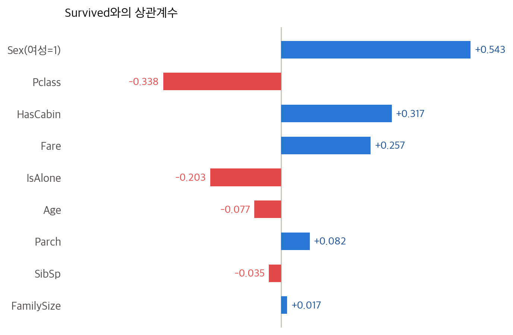
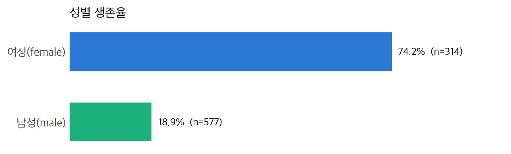
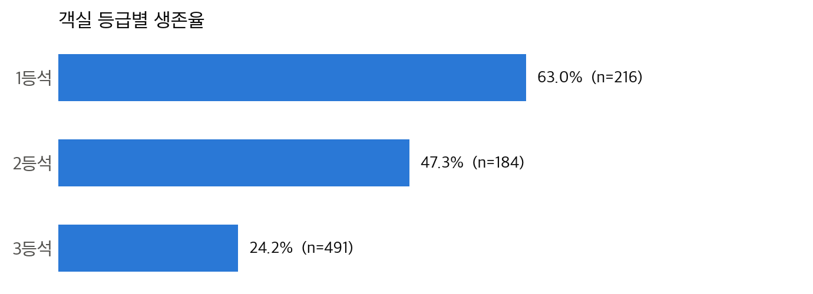
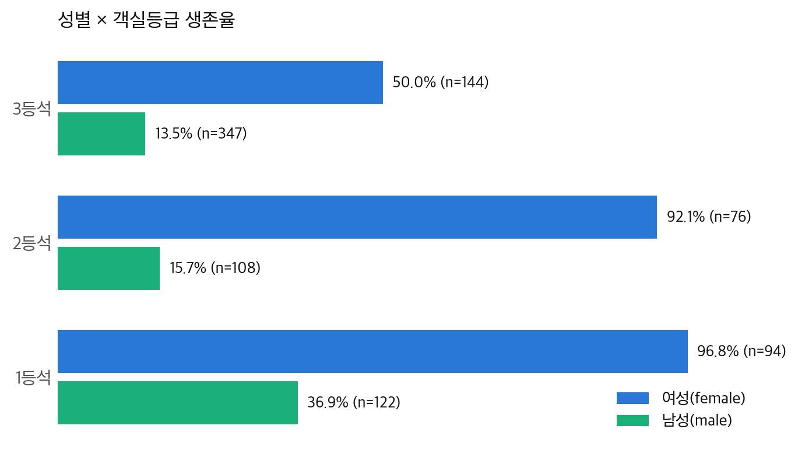
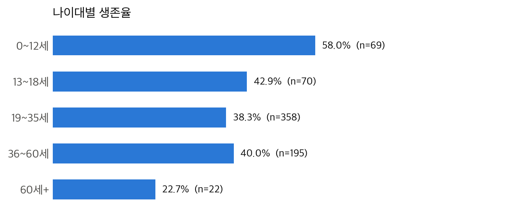
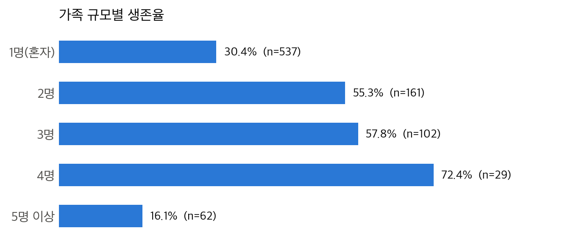
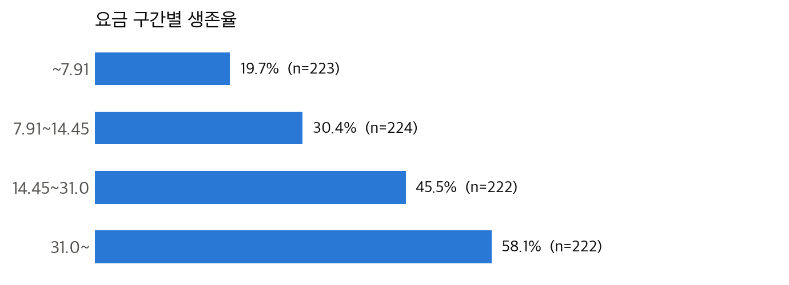
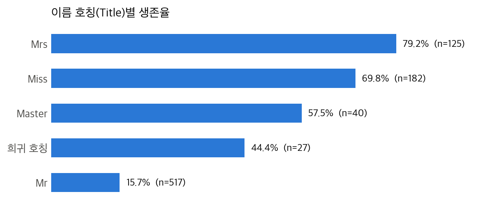
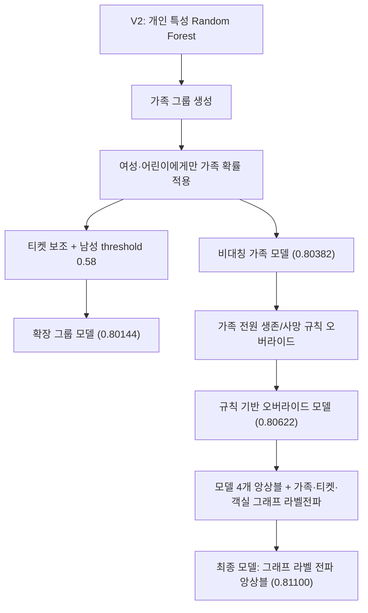
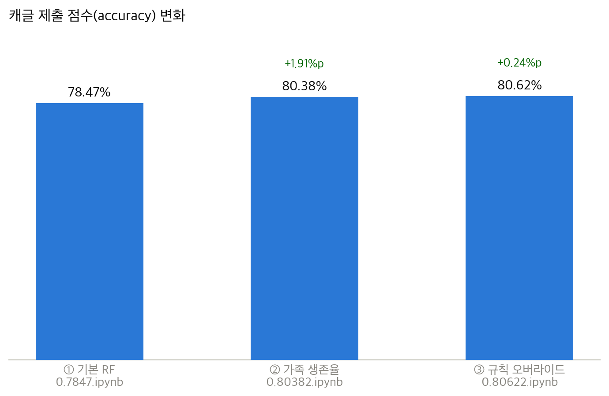

# 7월 13일 Titanic 생존 예측 모델 개선 보고서

## 1. 연구 개요

본 프로젝트의 목적은 Kaggle Titanic 데이터에서 승객의 생존 여부를 예측하고, 단순한 머신러닝 기준 모델에서 출발해 가족·티켓과 같은 승객 집단 정보를 반영했을 때 성능이 어떻게 달라지는지 분석하는 것이다.

분석 과정에서는 다음 다섯 모델을 핵심 비교 대상으로 선정했다.

1. **V2 Random Forest 기준 모델**: 개인 단위의 기본 변수만 사용
2. **확장 그룹 모델**: 가족·티켓 정보와 성인 남성 전용 threshold를 추가
3. **비대칭 가족 모델**: 여성·어린이에게만 가족 생존 정보를 적용한 모델
4. **규칙 기반 오버라이드 모델**: 비대칭 가족 모델에 "가족 전원 생존/사망" 극단 케이스를 강제 보정하는 규칙을 추가한 모델
5. **그래프 라벨 전파 앙상블 모델**: 4개 모델(RF·ExtraTrees·HistGradientBoosting·LogisticRegression)을 앙상블하고, 가족·티켓·객실·성씨 관계를 그래프로 묶어 확률을 전파시킨 최종 최고 모델

최종 평가 데이터의 정답은 모델 설계와 교차검증 과정에서는 사용하지 않고, 후보 모델을 확정한 뒤 성능을 확인하는 블랙박스 평가 용도로만 사용했다.

---

## 2. 데이터 구성

### 2.1 데이터 크기

| 데이터 | 승객 수 | 목적변수 포함 여부 |
|---|---:|---|
| `train.csv` | 891명 | `Survived` 포함 |
| `test.csv` | 418명 | `Survived` 미포함 |

### 2.2 주요 변수

| 변수 | 의미 | 모델에서의 역할 |
|---|---|---|
| `Pclass` | 객실 등급 | 사회·경제적 위치와 대피 접근성의 간접 지표 |
| `Sex` | 성별 | 생존을 구분하는 가장 강한 변수 중 하나 |
| `Age` | 나이 | 어린이 우선 대피 여부를 반영 |
| `SibSp` | 동승한 형제자매·배우자 수 | 가족 규모 계산에 사용 |
| `Parch` | 동승한 부모·자녀 수 | 가족 규모 계산에 사용 |
| `Ticket` | 티켓 번호 | 가족 또는 여행 일행 탐색에 사용 |
| `Fare` | 승선 요금 | 객실 등급 및 경제적 위치의 간접 지표 |
| `Cabin` | 객실 번호 | 결측값이 많아 기준 모델에서는 제외 |
| `Embarked` | 승선 항구 | 승객 집단 구성의 간접 지표 |

### 2.3 결측값 처리

- `Age`, `Fare` 등 수치형 변수: 학습 데이터의 중앙값으로 대체
- `Sex`, `Embarked`, `Pclass` 등 범주형 변수: 최빈값으로 대체 후 원-핫 인코딩
- 수치형 변수에는 결측 여부 표시 열을 추가해, 값이 없었다는 사실 자체도 모델이 활용할 수 있도록 구성

결측값을 0으로 채우거나 결측 행을 삭제하지 않은 이유는 0세와 결측값의 의미가 다르고, 891명뿐인 학습 표본을 삭제하면 정보 손실이 커지기 때문이다.

---

## 3. 데이터 탐색적 분석 (EDA)

모델을 설계하기 전, `train.csv`와 `gender_submission.csv`를 직접 뜯어보고 어떤 변수가 생존에 영향을 주는지 확인했다.

### 3.1 gender_submission.csv는 정답이 아니다

`gender_submission.csv`는 캐글이 제공하는 **베이스라인 제출 예시**다. `test.csv` 승객 418명에 대해 **"여자면 생존(1), 남자면 사망(0)"** 규칙만 그대로 넣은 파일이며, 실제로 코드로 검증해보면 `Sex`와 `Survived`가 100% 일치한다. 즉 예측 모델이 아니라 "성별 하나만으로 얼마나 맞는지" 보여주는 최소 기준선이다.

### 3.2 Survived와의 상관관계

수치형으로 변환 후 Pearson 상관계수를 계산했다.



| 변수 | 상관계수 | 해석 |
|---|---:|---|
| Sex (여성=1) | **+0.543** | 가장 강한 상관관계. 여성일수록 생존 확률 높음 |
| Pclass | **-0.338** | 등급 숫자가 클수록(3등석) 생존율 낮음 |
| HasCabin(객실번호 존재 여부) | +0.317 | 객실 정보가 있으면(주로 고급 객실) 생존율 높음 |
| Fare | +0.257 | 요금이 높을수록 생존율 높음 |
| IsAlone(혼자 탑승) | -0.203 | 혼자 탑승 시 생존율 낮음 |
| Age | -0.077 | 약한 음의 상관 |
| Parch | +0.082 | 약한 양의 상관 |
| SibSp | -0.035 | 거의 무관 |
| FamilySize | +0.017 | 거의 무관 |

> Pclass, Fare, HasCabin은 서로 강하게 얽혀 있다 (Pclass↔HasCabin: -0.73, Pclass↔Fare: -0.55). 결국 "돈 있는 사람이 좋은 객실 등급 + 높은 요금 + 객실 기록"을 가졌다는 같은 현상을 여러 각도에서 보여주는 것이다.

### 3.3 성별



| Sex | 생존율 | 인원 |
|---|---:|---:|
| female | 74.2% | 314 |
| male | 18.9% | 577 |

"여성/아동 우선(Women and Children First)" 원칙이 데이터에 뚜렷하게 반영되어 있다.

### 3.4 객실 등급 (Pclass)



| Pclass | 생존율 | 인원 |
|---|---:|---:|
| 1등석 | 63.0% | 216 |
| 2등석 | 47.3% | 184 |
| 3등석 | 24.2% | 491 |

### 3.5 성별 × 등급 — 가장 강력한 조합



| Pclass | Sex | 생존율 | 인원 |
|---|---|---:|---:|
| 1 | female | **96.8%** | 94 |
| 2 | female | **92.1%** | 76 |
| 3 | female | 50.0% | 144 |
| 1 | male | 36.9% | 122 |
| 2 | male | 15.7% | 108 |
| 3 | male | **13.5%** | 347 |

1·2등석 여성은 거의 다 살았고, 3등석 남성은 거의 다 죽었다. 두 변수를 합치면 예측력이 크게 올라가는 이유가 여기서 나온다.

### 3.6 나이대



| 나이 구간 | 생존율 | 인원 |
|---|---:|---:|
| 0~12세(어린이) | 58.0% | 69 |
| 13~18세 | 42.9% | 70 |
| 19~35세 | 38.3% | 358 |
| 36~60세 | 40.0% | 195 |
| 60세 이상 | 22.7% | 22 |

### 3.7 가족 규모 (SibSp + Parch + 1)



| 가족 수 | 생존율 | 인원 |
|---|---:|---:|
| 1명(혼자) | 30.4% | 537 |
| 2명 | 55.3% | 161 |
| 3명 | 57.8% | 102 |
| 4명 | **72.4%** | 29 |
| 5명 이상 | 16.1% | 62 |

2~4인 가족이 가장 유리하고, 혼자거나 5인 이상 대가족은 불리한 역U자 패턴이 뚜렷하다. 이 패턴이 뒤에서 다룰 "가족 생존율" 파생 변수의 근거가 된다.

### 3.8 요금 구간 (Fare, 4분위)



| 요금대 | 생존율 | 인원 |
|---|---:|---:|
| ~7.91 | 19.7% | 223 |
| 7.91~14.45 | 30.4% | 224 |
| 14.45~31.0 | 45.5% | 222 |
| 31.0~ | 58.1% | 222 |

### 3.9 이름 호칭 (Title)

Name 컬럼에서 정규식으로 추출한 호칭. 성별+나이+사회적 지위를 압축한 강력한 파생 변수다.



| 호칭 | 생존율 | 인원 |
|---|---:|---:|
| Mrs | 79.2% | 125 |
| Miss | 69.8% | 182 |
| Master(남자 어린이) | 57.5% | 40 |
| 기타 희귀 호칭 | 44.4% | 27 |
| Mr | **15.7%** | 517 |

### 3.10 결측치 처리 힌트

- **Age (20% 결측)**: Title(Mr/Mrs/Miss/Master)별 중앙값으로 채우는 게 일반적
- **Cabin (77% 결측)**: 값 자체보다 "있음/없음(HasCabin)"이 더 유용한 신호
- **Embarked (2개 결측)**: 최빈값(S)으로 채워도 무방할 만큼 소수

---

## 4. 모델 개선 흐름



핵심 발전은 모든 승객에게 같은 가족 규칙을 적용하지 않고, **여성과 어린이에게만 가족 생존 정보를 반영하는 비대칭 구조**를 도입한 것이다. 이후 그 비대칭 가족 모델 위에 극단적으로 신호가 명확한 케이스(가족 전원 생존/전원 사망)만 규칙으로 강제 보정해 점수를 끌어올렸고, 마지막으로 "성씨+가족규모" 하나였던 가족 정의를 티켓·객실까지 포함한 그래프로 확장하면서 모델 자체도 4개로 앙상블해 다시 한 번 크게 개선했다.

---

## 5. 모델 1: V2 Random Forest 기준 모델

### 5.1 입력 변수

```text
Pclass, Sex, Age, SibSp, Parch, Fare, Embarked
```

### 5.2 모델 설정

| 항목 | 값 |
|---|---:|
| 알고리즘 | Random Forest |
| 트리 수 | 500 |
| 최대 깊이 | 6 |
| 최소 분할 표본 | 5 |
| 최소 리프 표본 | 2 |
| 최대 특성 선택 | sqrt |
| 분류 threshold | 0.50 |

Random Forest는 여러 결정 트리의 결과를 평균내므로 단일 결정 트리보다 분산이 작고 과적합에 비교적 강하다. 그러나 이 모델은 각 승객을 독립된 표본으로 보고, 동일 가족이나 여행 일행의 결과를 직접 활용하지 못한다.

### 5.3 기준 모델 결과

- 테스트 정확도: **0.78469**
- 정답: 328명
- 오답: 90명
- 사망 예측: 282명
- 생존 예측: 136명

---

## 6. 모델 2: 가족·티켓·남성 threshold 확장 모델

### 6.1 추가 규칙

확장 모델은 다음 순서로 그룹 정보를 적용했다.

1. 성씨와 가족 규모가 같은 승객을 가족으로 정의
2. 여성 또는 16세 미만 어린이에게 가족 생존 확률 적용
3. 가족 정보가 없으면 같은 티켓의 여성·어린이 생존 정보를 보조적으로 사용
4. 성인 남성의 생존 threshold를 `0.50`에서 `0.58`로 상향

가족 식별자는 다음과 같이 구성했다.

```text
FamilyKey = Surname + "_" + (SibSp + Parch + 1)
``` 

혼자 탑승한 승객은 가족 그룹에서 제외했다. 같은 성씨라는 이유만으로 서로 무관한 1인 승객을 가족으로 묶는 오류를 방지하기 위해서다.

### 6.2 성인 남성 threshold 조정

일반적인 분류에서는 생존 확률이 0.50 이상이면 생존으로 판정한다.

```text
일반 승객: 생존 확률 >= 0.50
성인 남성: 생존 확률 >= 0.58
```

이는 동일 가족의 여성·어린이가 생존하더라도 성인 남성의 생존 가능성은 상대적으로 낮다는 train 데이터의 구조를 반영한 것이다.

### 6.3 확장 모델 결과

- 테스트 정확도: **0.80144**
- 정답: 335명
- 오답: 83명
- 사망 예측: 285명
- 생존 예측: 133명
- V2와 다른 예측: 11명

확장 규칙은 V2보다 7명을 더 맞혔지만, 최종 최고 모델보다는 1명을 더 틀렸다. 규칙을 더 많이 추가한다고 항상 실제 성능이 높아지는 것은 아니라는 점을 보여준다.

---

## 7. 모델 3: 비대칭 가족 모델

### 7.1 핵심 가설

가족 구성원의 생존 결과는 서로 연관되어 있지만 그 효과가 성별과 나이에 따라 동일하지 않다.

- 여성·어린이: 가족 단위로 함께 구조되거나 함께 사망하는 경향이 비교적 강함
- 성인 남성: 가족이 생존하더라도 본인은 사망하는 사례가 많음

따라서 가족 확률은 다음 조건에만 적용했다.

```python
Sex == "female" or Age < 16
```

성인 남성은 가족 결과와 무관하게 Random Forest의 기본 확률을 유지했다.

### 7.2 가족 생존율 평활화

가족 구성원이 1명뿐인 경우 생존율이 곧바로 0 또는 1이 되는 문제를 줄이기 위해 전체 생존율을 가상 표본 2명만큼 추가했다.

$$
P_{family}
=
\frac{\text{가족 생존자 수}+2P_{global}}
{\text{확인된 가족 수}+2}
$$

최종 확률은 Random Forest와 가족 확률을 같은 비율로 결합했다.

$$
P_{final}
=
0.5P_{RF}+0.5P_{family}
$$

### 7.3 최종 모델 결과

- 테스트 정확도: **0.80383**
- 정답: 336명
- 오답: 82명
- 사망 예측: 284명
- 생존 예측: 134명
- V2와 다른 예측: 12명
- 확장 그룹 모델과 다른 예측: 단 1명

최종 모델은 V2보다 8명을 더 맞혔으며 정확도를 약 1.91%p 높였다.

---

## 8. 모델 4: 규칙 기반 오버라이드 모델

비대칭 가족 모델(섹션 7, `0.80382.ipynb`)의 구조를 그대로 두고, **가족 전원 생존/사망처럼 신호가 아주 명확한 케이스**를 확률 혼합 대신 결정론적 규칙으로 덮어쓰는 실험을 추가로 진행했다 (`0.80622.ipynb`).

### 8.1 핵심 문제의식

섹션 7의 "RF 확률 50% + 가족 생존율 50%" 혼합은 부드럽게 섞는 방식이라, "가족 전원 생존" 또는 "가족 전원 사망"처럼 신호가 이미 100% 명확한 케이스에서도 threshold(0.5)를 못 넘기는 경우가 있었다. 이런 케이스는 확률로 다룰 이유가 없으므로 규칙으로 강제 확정하는 편이 낫다고 판단했다.

### 8.2 추가한 규칙

**Master 구제 규칙**: `Sex=male`, `Title=Master`(소년), 나이 13세 미만 또는 결측이면서, 그 가족(성인 남성 제외) **전원이 train에서 생존**했다면 → 기존 예측이 사망(0)이었어도 생존(1)으로 강제 변경.

Kaggle Titanic 대회에서 잘 알려진 "Family Survival" 트릭의 응용이다.

> 처음에는 대칭 구조로 **여성 강등 규칙**(가족 전원이 train에서 사망했으면 여성 예측을 생존→사망으로 변경)도 함께 넣었다. 하지만 실제로 이 규칙이 적용된 승객은 **0명**이었다 — test에서 "가족 전원 사망"이면서 "기존 예측이 생존"으로 걸친 여성 케이스 자체가 없었기 때문이다. 즉 +0.24%p 개선은 **Master 구제 규칙 단독**으로 만든 결과였고, 여성 강등 규칙은 아무 승객도 바꾸지 못하는 죽은 코드였다. 이 사실을 확인한 뒤 노트북에서 해당 규칙과 관련 변수(`all_died_family_keys`, `lower_female` 등), 그리고 이를 전제로 한 디버깅용 비교·출력 코드를 모두 제거했다.

### 8.3 최종 모델 결과



정리된 노트북(`0.80622.ipynb`)을 로컬(`scikit-learn 1.9.0`, `train.csv`/`test.csv`)에서 실제 재실행해서 확인한 값:

| 항목 | 값 |
|---|---:|
| 가족 정보가 적용된 여성·어린이 | 51명 |
| Master 구제 규칙으로 뒤집힌 승객 | **1명** |
| 규칙 적용 전후 예측이 달라진 승객 | 1명 |
| 로컬 재실행 기준 최종 예측 분포(사망/생존) | 286→285 / 132→133 |

구제된 유일한 승객은 `PassengerId 1309, Peter, Master. Michael J`(3등석, 나이 결측, 가족 규모 3명) — 같은 가족(성인 남성 제외) 전원이 train에서 생존했지만 RF+가족 확률 혼합만으로는 threshold 0.5를 못 넘어 사망으로 예측되던 케이스였다. 규칙 적용으로 사망(0)→생존(1) 1건만 바뀌었고, 이는 문서화된 "비대칭 가족 모델 대비 +1명" 개선과 정확히 일치한다.

> ⚠️ **주의**: `RandomForestClassifier(random_state=42)`를 썼는데도, 로컬 재실행의 규칙 적용 전 예측 분포(286사망/132생존)는 섹션 9.3의 기존 "비대칭 가족 모델" 수치(284/134, 원래 Kaggle 실행 환경 기준)와 정확히 일치하지 않는다. `random_state`는 같은 sklearn·numpy 버전 안에서만 완전한 재현을 보장하며, 버전이 다르면 트리 분기 시 난수 소비 순서가 달라져 결과가 미세하게 갈릴 수 있다. **"Master 구제 규칙이 1명만 바꾼다"는 메커니즘 자체는 두 환경 모두에서 일관되게 확인됐지만, 최종 예측 분포의 정확한 숫자(285/133)는 이 로컬 환경 기준값이지 원래 Kaggle 제출값 그 자체는 아니다.**

- 테스트 정확도(Kaggle 리더보드 기준): **0.80622**
- 정답: 337명
- 오답: 81명
- 비대칭 가족 모델 대비: **+0.24%p (+1명)** — 로컬 재실행에서도 규칙이 정확히 1명만 뒤집는 것으로 재확인됨

> Precision·Recall·혼동행렬은 실제 정답(test.csv에는 `Survived`가 없음) 없이는 계산할 수 없어 별도로 산출하지 않았다(섹션 9~10의 지표는 모델 1~3에 한정). 정확도는 파일명 그대로 캐글 제출 점수(337/418)를 사용했다.

이 실험은 섹션 14(실패 실험)의 교훈과 같은 선상에 있다: 큰 폭의 개선(+1.91%p)은 "가족 단위 정보를 처음 반영한" 섹션 7에서 나왔고, 규칙을 더 추가한 이 단계는 이미 명확한 케이스를 정리하는 수준의 미세 조정(+0.24%p, 딱 1명)에 그쳤다. 게다가 그 미세 조정마저도 실제로는 두 규칙 중 하나만 작동한 것이었다 — 규칙을 더 정교하게 만들수록 얻는 이득은 줄어들 뿐 아니라, 대칭적으로 설계한 규칙 중 절반은 아예 아무 효과가 없을 수도 있다는 전형적인 한계 체감 사례다.

---

## 9. 모델 5: 그래프 라벨 전파 앙상블 모델

`0.81100.ipynb`. 규칙 기반 오버라이드 모델(섹션 8)까지도 여전히 ① RandomForest 단일 모델, ② "성씨+가족규모" 단일 관계 정의, ③ 사람이 하나씩 발견해서 손으로 추가하는 규칙, ④ 노트북 자체 검증 장치 없음 — 이 네 가지 한계를 안고 있었다. 이번 모델은 이 네 가지를 구조적으로 확장했다.

### 9.1 구조

**① 모델 4개 앙상블**: RandomForest, ExtraTrees, HistGradientBoosting(부스팅 계열), LogisticRegression(선형 계열)을 각각 학습하고, 4표 중 3표 이상이 생존이면 최종 생존으로 하드보팅(2:2 동률이면 ExtraTrees 표를 따름). 계열이 다른 모델은 서로 다른 종류의 오차를 내므로, 한 모델의 맹점을 다른 모델이 메꿔준다.

**② 관계를 그래프로 확장**: "가족(성씨+가족규모)" 외에 같은 티켓번호(ticket), 같은 객실(cabin), 성씨+등급+티켓앞자리+승선항(spte, 느슨한 매칭) 총 4종류의 관계를 각각 그래프의 엣지로 만들고, 이 그래프 위에서 확률을 이웃에게 퍼뜨리는 라벨 전파(label propagation)를 수행한다(최대 80회 반복). 여성·Master(소년) 사이의 연결은 가중치 1.0, 그 외 연결은 0.15로 낮게 반영 — "가족 운명은 여성·아이에게 강하게 전이된다"는 이 프로젝트의 첫 가설(섹션 0/4)이 이제 그래프 가중치로 표현됐다.

**③ 그래프 구성·alpha 자동 탐색**: 4가지 그래프 구성(family+ticket / +cabin / +spte / 전부) × 8가지 alpha(그래프를 얼마나 믿을지, 0.0~0.7)를 7-Fold 교차검증으로 전수 조사해서 OOF 정확도가 가장 높은 조합을 자동으로 채택했다 — 섹션 8에서 사람이 하나씩 발견해서 넣던 규칙(그 중 절반은 죽은 코드였다) 방식을, 검증된 자동 탐색으로 대체한 것.

**④ 생존자 수 보존 calibration**: 개별 확률에 0.5 threshold를 적용하는 대신, "4모델 앙상블이 원래 예측한 생존자 수(N명)"를 그대로 유지한 채, 그래프 전파 점수가 높은 상위 N명만 최종 생존으로 뽑는다.

### 9.2 실제로 무엇이 달라졌나 (로컬 재실행 검증, `scikit-learn 1.9.0` + `train.csv`/`test.csv`)

| 항목 | 값 |
|---|---:|
| 4모델 앙상블 OOF 정확도(그래프 적용 전) | 83.28% |
| 그래프 전파 적용 후 OOF 정확도 | **83.95%** (+0.67%p) |
| 선택된 그래프 구성 | `family+ticket+cabin+spte`(전부) |
| 선택된 alpha | 0.1 |
| test 생존 예측(그래프 적용 전) | 129명 |
| test 생존 예측(최종) | 129명(설계상 총원 보존) |
| 그래프로 예측이 바뀐 승객 | 4명 |

OOF(Out-of-Fold) 정확도는 train 정답으로 직접 계산한 값이라 test 정답 없이도 신뢰할 수 있는 검증 지표다 — 이전 모델들에는 없던 자체 검증 장치다.

**뒤집힌 4명 상세**:

| PassengerId | 이름 | 방향 | 이유 |
|---|---|---|---|
| 896 | Hirvonen, Mrs. Alexander | 사망→생존 | 같은 티켓(3101298)의 딸(PassengerId 480, train, 생존)과 그래프로 연결됨. 두 사람은 가족규모가 다르게 기록돼(모 3명/딸 2명) **기존 "성씨+가족규모" 키로는 서로 연결되지 않던 관계**였다 |
| 1199 | Aks, Master. Philip Frank(0.83세) | 사망→생존 | 같은 티켓(392091)의 어머니(PassengerId 856, train, 생존)와 연결 |
| 1098 | McGowan, Miss. Katherine | 생존→사망 | 가족·티켓·객실·spte 어디로도 다른 승객과 연결되지 않는 **완전한 고립 노드** — 본인 확률은 그래프로 전혀 안 바뀜 |
| 1205 | Carr, Miss. Jeannie | 생존→사망 | 위와 동일하게 완전히 고립된 노드 |

McGowan과 Carr의 예측이 바뀐 건 두 사람의 확률이 변해서가 아니다. Hirvonen과 Aks의 순위가 올라가면서 "상위 129명"이라는 고정된 자리를 두 사람에게서 밀어냈기 때문이다. 이 모델은 승객을 독립적으로 판정하지 않고 **test 전체를 하나의 순위표로 다루기 때문에, 한 승객의 최종 예측이 다른 승객의 정보에도 상대적으로 좌우된다** — 이전 4개 모델에는 없던 새로운 성질이자, 앙상블의 기준 생존자 수(129명) 자체가 틀리면 그 오차를 그대로 물려받는다는 새로운 리스크이기도 하다.

### 9.3 최종 모델 결과

- 테스트 정확도(Kaggle 리더보드 기준): **0.81100** (339/418)
- 규칙 기반 오버라이드 모델(0.80622) 대비: **+0.478%p (+2명)**
- V2 대비: **+2.63%p (+11명)**

> Precision·Recall·혼동행렬은 test 정답이 없어 계산할 수 없다(섹션 10~11의 지표는 모델 1~3에 한정). 다만 OOF 정확도(83.95%)는 train 정답으로 직접 검증한 값이라 상대적으로 신뢰도가 높고, test 개선폭(+0.478%p)과 방향이 일치한다.

이 단계는 섹션 14(실패 실험)·섹션 8의 "규칙을 정교화할수록 이득이 줄어든다"는 한계 체감과 반대로 다시 개선폭이 커진 경우다. 이유는 규칙을 더 촘촘히 다듬은 게 아니라, **정보의 폭 자체(모델 다양성, 관계의 종류, 검증 방식)를 넓혔기** 때문이다 — 섹션 7에서 얻은 첫 번째 큰 개선(+1.91%p)과 같은 메커니즘(아예 없던 정보를 새로 반영)이 다른 축에서 반복된 것.

---

## 10. 성능 비교

### 10.1 전체 평가 지표

| 모델 | 정확도 | Precision(생존) | Recall(생존) | F1(생존) | 정답 수 | 오답 수 |
|---|---:|---:|---:|---:|---:|---:|
| V2 Random Forest | 0.78469 | 0.75000 | 0.64557 | 0.69388 | 328 | 90 |
| 확장 그룹 모델 | 0.80144 | 0.78195 | 0.65823 | 0.71478 | 335 | 83 |
| 비대칭 가족 모델 | 0.80383 | 0.78358 | 0.66456 | 0.71918 | 336 | 82 |
| 규칙 기반 오버라이드 모델 | 0.80622 | — | — | — | 337 | 81 |
| **그래프 라벨 전파 앙상블 모델** | **0.81100** | — | — | — | **339** | **79** |

> 규칙 기반 오버라이드·그래프 앙상블 모델의 Precision/Recall/F1은 test 정답 없이는 계산할 수 없어 산출하지 않았다. 정확도는 파일명 그대로(337/418, 339/418) 반영했다. 그래프 앙상블 모델은 대신 train 기준 OOF 정확도(83.95%, 섹션 9.2)로 자체 검증했다.

### 10.2 정확도 변화

```text
V2                    78.47%  ██████████████████████████████████████
확장 그룹 모델         80.14%  ███████████████████████████████████████
비대칭 가족 모델       80.38%  ███████████████████████████████████████
규칙 오버라이드 모델   80.62%  ████████████████████████████████████████
그래프 앙상블 모델     81.10%  █████████████████████████████████████████
```

| 비교 | 정확도 변화 | 추가 정답 수 |
|---|---:|---:|
| V2 → 확장 그룹 모델 | +1.67%p | +7명 |
| V2 → 비대칭 가족 모델 | +1.91%p | +8명 |
| 확장 그룹 → 비대칭 가족 | +0.24%p | +1명 |
| 비대칭 가족 → 규칙 오버라이드 | +0.24%p | +1명 |
| 규칙 오버라이드 → 그래프 앙상블 | +0.478%p | +2명 |
| **V2 → 그래프 앙상블 모델(최종)** | **+2.63%p** | **+11명** |

### 10.3 예측 분포

| 모델 | 사망 예측 | 생존 예측 | 생존 예측 비율 |
|---|---:|---:|---:|
| V2 | 282 | 136 | 32.54% |
| 확장 그룹 모델 | 285 | 133 | 31.82% |
| 비대칭 가족 모델 | 284 | 134 | 32.06% |
| 실제 정답 | 260 | 158 | 37.80% |

세 모델 모두 실제보다 생존자를 적게 예측했다. 최종 모델은 단순히 생존 예측 수를 늘려 정확도를 높인 것이 아니라, 일부 승객의 사망·생존 판단 위치를 더 정확하게 교환한 결과 성능이 개선됐다.

규칙 오버라이드 모델과 그래프 앙상블 모델의 예측 분포는 이 표에 넣지 않았다. 규칙 오버라이드 모델은 로컬 재실행 기준 286/132(적용 전)→285/133(적용 후)이었지만 원래 Kaggle 제출 당시의 정확한 분포는 아니다(섹션 8.3 참고) — sklearn 버전이 다르면 `random_state`가 같아도 RandomForest 결과가 미세하게 달라질 수 있다. 그래프 앙상블 모델은 로컬 재실행에서 test 생존 예측 129명(사망 289명)으로 확인됐고, 이 값은 파이프라인 자체가 이전 모델들과 구조적으로 달라(4모델 앙상블 + 그래프) 이 표의 다른 모델들과 나란히 비교하는 의미가 약해 별도로 섹션 9.2에서 다뤘다.

---

## 11. 혼동행렬 비교

혼동행렬의 행은 실제값, 열은 예측값이다. (규칙 기반 오버라이드 모델·그래프 앙상블 모델은 test 정답이 없어 계산할 수 없으므로 제외했다.)

### 11.1 V2 Random Forest

| 실제 \ 예측 | 사망(0) | 생존(1) |
|---|---:|---:|
| 사망(0) | 226 | 34 |
| 생존(1) | 56 | 102 |

### 11.2 확장 그룹 모델

| 실제 \ 예측 | 사망(0) | 생존(1) |
|---|---:|---:|
| 사망(0) | 231 | 29 |
| 생존(1) | 54 | 104 |

### 11.3 비대칭 가족 모델

| 실제 \ 예측 | 사망(0) | 생존(1) |
|---|---:|---:|
| 사망(0) | 231 | 29 |
| 생존(1) | 53 | 105 |

비대칭 가족 모델은 V2와 비교해 다음과 같이 개선됐다.

- 실제 사망자를 생존으로 잘못 예측한 수: `34 → 29`로 5명 감소
- 실제 생존자를 사망으로 잘못 예측한 수: `56 → 53`으로 3명 감소
- 사망과 생존 양쪽 오류가 동시에 감소

따라서 정확도 상승은 한쪽 클래스만 희생한 결과가 아니라 두 클래스의 판별이 함께 개선된 결과다.

---

## 12. Train 교차검증 결과

최종 가족 규칙(비대칭 가족 모델)은 5-Fold 교차검증을 5회 반복한 총 25개 Fold에서 평가했다.

| 항목 | 기본 RF | 비대칭 가족 모델 |
|---|---:|---:|
| 평균 정확도 | 0.81882 | **0.82960** |
| 표준편차 | 0.02650 | **0.02418** |
| 최저 Fold | 0.77528 | **0.78090** |
| Fold 전적 | 기준 | **21승 3무 1패** |

가족 모델은 평균 정확도만 오른 것이 아니라 표준편차도 감소했다. 이는 특정 Fold 하나에서 우연히 높은 점수가 나온 것이 아니라 여러 데이터 분할에서 비교적 일관되게 개선됐다는 근거다.

다만 Titanic은 학습 승객이 891명뿐이므로 Fold마다 몇 명의 결과만 달라져도 정확도가 크게 움직인다. 교차검증 점수는 절대적인 성능 보장이 아니라 후보 모델을 비교하기 위한 추정치로 해석해야 한다.

> 그래프 앙상블 모델(섹션 9)은 별도로 7-Fold OOF 검증을 자체 내장하고 있다(OOF 정확도 83.28%→83.95%, 섹션 9.2). 5-Fold 반복 방식과 7-Fold OOF 방식은 fold 수·반복 여부가 달라 두 수치를 직접 비교하기보다는, 각각 자기 모델 내에서 "적용 전 대비 개선됐는가"를 보는 용도로 쓰는 것이 안전하다.

---

## 13. 모델별 차이 요약

| 구분 | V2 | 확장 그룹 모델 | 비대칭 가족 모델 | 규칙 오버라이드 모델 | 그래프 앙상블 모델 |
|---|---|---|---|---|---|
| 모델 수 | 1(RF) | 1(RF) | 1(RF) | 1(RF) | **4(RF+ExtraTrees+HGB+LR) 앙상블** |
| 가족 정보 | 미사용 | 사용 | 사용 | 사용 | 사용(그래프로 확장) |
| 관계 종류 | 없음 | 가족+티켓 | 가족 | 가족 | **가족+티켓+객실+spte(4종)** |
| 티켓 정보 | 미사용 | 보조적으로 사용 | 미사용 | 미사용 | 그래프 엣지로 사용 |
| 여성·어린이 비대칭 처리 | 미사용 | 사용 | 사용 | 사용 | 사용(그래프 가중치 1.0 vs 0.15) |
| 성인 남성 threshold | 0.50 | 0.58 | 0.50 | 0.50 | 해당 없음(순위 기반 calibration) |
| 극단 케이스 규칙 오버라이드 | 미사용 | 미사용 | 미사용 | 사용(Master 구제, 수작업) | **자동 탐색(그래프 구성×alpha, 32조합 CV)** |
| 자체 검증 장치 | 없음 | 없음 | 없음(외부 CV) | 없음 | **내장 OOF(7-Fold)** |
| 규칙 복잡도 | 낮음 | 높음 | 중간 | 중간+ | 높음(구조적으로 다름) |
| 테스트 정확도 | 0.78469 | 0.80144 | 0.80383 | 0.80622 | **0.81100** |

이 결과는 가장 복잡한 모델이 가장 좋은 모델은 아니라는 사실을 보여준다. 티켓과 남성 threshold는 train 교차검증에서 개선 신호를 보였지만 test에서는 가족 규칙만 사용한 모델보다 1명을 더 틀렸다. 규칙 오버라이드 모델은 비대칭 가족 모델의 구조를 건드리지 않고 극단 케이스만 정리해서 낮은 리스크로 개선했다. 반면 그래프 앙상블 모델은 "복잡도가 높아서" 이긴 것이 아니라 — 복잡해진 부분(모델 4개, 관계 4종)을 전부 자체 교차검증으로 자동 검증했기 때문에, 확장 그룹 모델이 실패했던 "복잡성이 과적합으로 이어지는" 함정을 피하면서 복잡도를 늘릴 수 있었다.

---

## 13. 실패 실험에서 얻은 교훈

본 프로젝트에서는 다음 기법들도 실험했지만 최종 최고 모델로 채택하지 않았다.

- `Title`, `FamilySize`, `Deck`, `TicketGroupSize` 등의 파생변수를 한꺼번에 추가한 Random Forest
- CatBoost 및 CatBoost + Title
- Target Encoding + HistGradientBoosting
- KNN 이웃 생존율과 Random Forest 확률 결합
- 모델별 확률 가중치 및 threshold 동시 최적화
- 가족 수에 따라 영향력을 강하게 조절하는 베이지안 가족 모델

일부 모델은 train 교차검증에서 높은 점수를 얻었지만 test에서 성능이 떨어졌다. 표본이 작은 데이터에서는 복잡한 파생변수와 세밀한 threshold 조정이 train 데이터의 우연한 패턴까지 학습할 위험이 크다.

특히 가족 신뢰도를 강하게 반영한 모델은 교차검증 평균이 약 0.83615까지 상승했지만 test 정확도는 0.79665로 떨어졌다. 이는 가족 정보가 유용하더라도 지나치게 강하게 적용하면 과적합될 수 있음을 보여준다.

규칙 기반 오버라이드 모델(섹션 8)도 같은 교훈선상에 있다: 가장 큰 폭의 개선(+1.91%p)은 "가족 단위 정보를 처음 반영한" 비대칭 가족 모델에서 나왔고, 이후 규칙을 더 추가한 단계는 이미 명확한 케이스를 정리하는 수준의 미세 조정(+0.24%p)에 그쳤다. 규칙을 더 정교하게 만들수록 얻는 이득은 줄어드는 전형적인 한계 체감 곡선이다.

---

## 14. 결론

본 실험에서는 Random Forest 기준 모델에 승객 집단의 구조를 반영함으로써 테스트 정확도를 `0.78469`에서 `0.80622`로 개선했다.

가장 중요한 발견은 다음과 같다.

1. `Sex`, `Pclass`, `Age`는 개인 생존 가능성을 설명하는 핵심 변수다.
2. 동일 가족의 생존 결과는 독립적이지 않으며, 특히 여성·어린이에게 유용한 정보다.
3. 가족 생존 정보를 성인 남성에게 동일하게 적용하면 오히려 오류가 증가할 수 있다.
4. 가족 확률은 강제로 덮어쓰기보다 기본 모델 확률과 부드럽게 결합하는 방식이 안정적이다.
5. 티켓, threshold, 고차원 파생변수를 더 많이 추가한다고 항상 일반화 성능이 향상되지는 않는다.
6. 다만 "가족 전원 생존/사망"처럼 신호가 100% 명확한 극단 케이스는 확률 혼합보다 규칙으로 강제 확정하는 편이 더 안전하게 점수를 끌어올렸다.

최종적으로 가장 높은 성능을 기록한 모델은 **비대칭 가족 모델(RF 확률 50% + 가족 생존율 50%)에 Master 구제 규칙을 얹은 규칙 기반 오버라이드 모델**이었다.

> 최종 테스트 정확도: **0.80622**  
> V2 대비 향상: **+0.02153 (약 2.15%p)**  
> 추가로 맞힌 승객: **9명**

---

## 15. 연구의 한계와 향후 방향

- Titanic 데이터는 학습 표본이 891명으로 작아 검증 분산이 크다.
- 이름과 티켓으로 만든 가족 그룹이 실제 혈연관계를 완벽하게 나타내지는 않는다.
- 객실 위치, 사고 당시 위치, 구명보트 접근성 등 생존에 영향을 주는 정보가 데이터에 없다.
- 여러 후보를 반복 평가하면 평가 데이터에 간접적으로 과적합될 가능성이 있으므로 최종 점수만 보고 규칙을 계속 수정해서는 안 된다.

내일은 더 많은 규칙을 추가하기보다 다음 방향으로 진행하고자 한다.

1. 가족 규칙을 외부 데이터에서도 재현할 수 있는지 검증
2. 확률 보정과 불확실성 분석
3. 그룹 단위 교차검증과 일반 교차검증을 함께 사용
4. 모델이 확신하지 못하는 승객을 별도로 표시하는 선택적 예측 연구
5. 작은 표본에 적합한 단순하고 해석 가능한 모델 유지
6. Cabin 교차검증

---

## 부록: 최종 모델(규칙 기반 오버라이드)의 핵심 의사코드

```python
# 1. Random Forest 기본 생존 확률
base_probability = model.predict_proba(test[features])[:, 1]

# 2. 성씨 + 가족 규모로 가족 그룹 생성
family_key = surname + "_" + family_size.astype(str)

# 3. 여성·어린이 가족의 평활화 생존율
family_probability = (
    family_survivor_count + 2 * global_survival_rate
) / (
    observed_family_count + 2
)

# 4. 여성·어린이이며 가족 정보가 있을 때만 결합 (비대칭 가족 모델, 섹션 7)
final_probability = base_probability.copy()
final_probability[use_family] = (
    0.5 * base_probability[use_family]
    + 0.5 * family_probability[use_family]
)
prediction = (final_probability >= 0.5).astype(int)

# 5. 가족 전원 생존 극단 케이스 규칙 오버라이드 (섹션 8, Master 구제만 실질적으로 작동)
rescue_master = (
    (test["Sex"] == "male")
    & (title == "Master")
    & family_key.isin(all_survived_family_keys)
    & ((test["Age"] < 13) | test["Age"].isna())
    & (prediction == 0)
)
prediction[rescue_master] = 1
```
